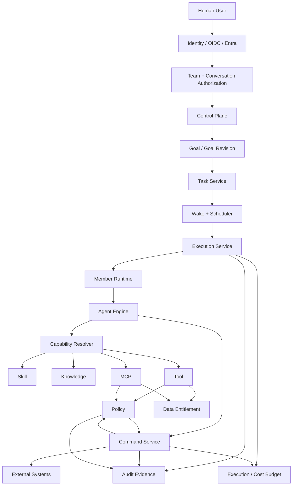
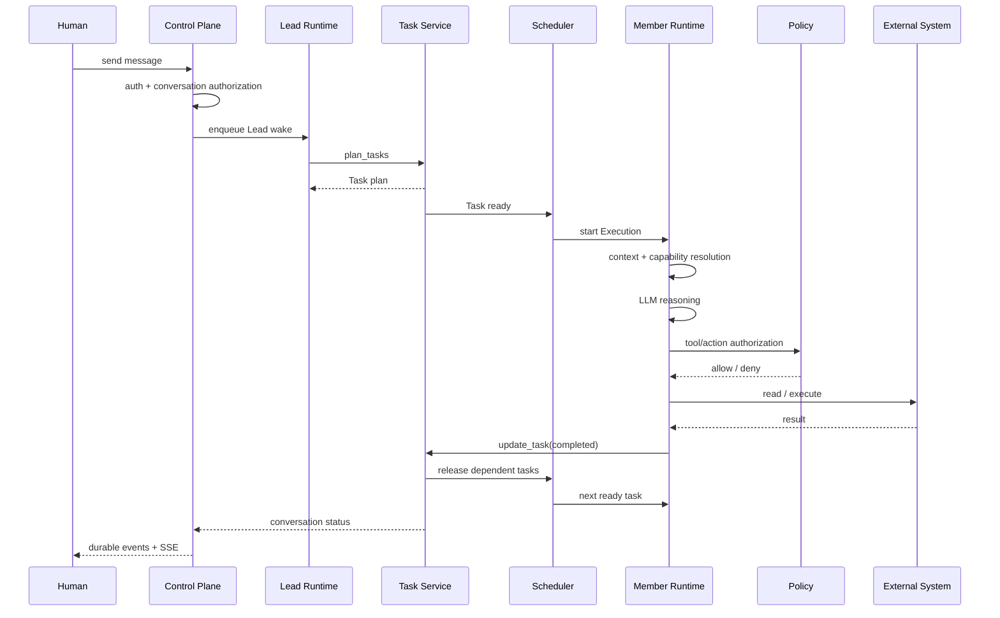
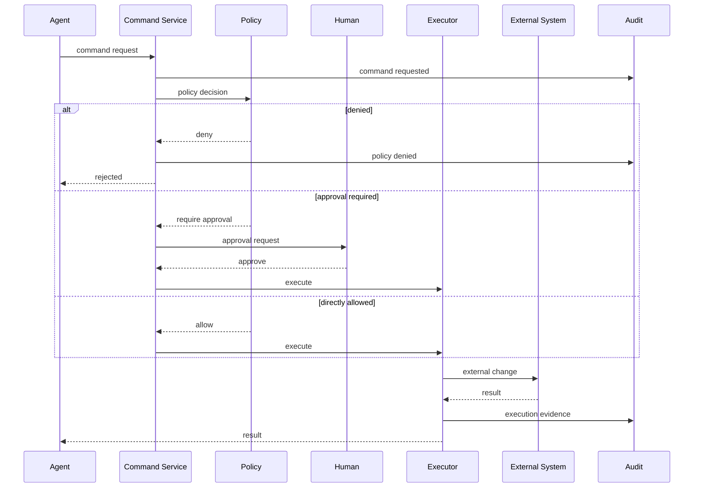

# team-member-copilot-agent 新架构设计

> 文档版本：vNext / 0.5 Architecture  
> 基线：`saga/team-member-copilot-agent` 当前 `main`  
> 基准提交：`0564e9a011729e496bca3d1509cd6d2928e7e7ba`  
> 文档目的：在当前实现基础上，给出下一阶段可直接落地的目标架构。  
>
> 这份文档不是推翻当前代码重做，而是明确：
>
> 1. 当前代码已经成立的核心模型；
> 2. 必须修正的设计/实现问题；
> 3. 下一阶段应形成的 Control Plane / Runtime / Governance 架构；
> 4. 哪些能力暂时不要引入，避免过度设计。

---

# 1. 系统定位

`team-member-copilot-agent` 不应该被定义成“多个 Agent 聊天”。

它更准确的定位是：

> **一个以 Goal / Task 为业务核心，以 Member Runtime 为执行单元，由确定性 Control Plane 管理 Agent 执行、授权、恢复和审计的 AI Team Runtime。**

核心模型：

```text
Human
  │
  ▼
Conversation / Work
  │
  ▼
Goal Revision
  │
  ├───────────────┐
  ▼               ▼
Lead            Tasks
                  │
                  ▼
              Scheduler
                  │
                  ▼
              Execution
                  │
                  ▼
            Member Runtime
                  │
                  ▼
             Agent Engine
```

Agent 的自由主要存在于：

```text
下一步怎么做
如何分析
如何推理
如何组织结果
```

Agent 不应该决定：

```text
谁是谁
谁属于哪个 Team
系统允许哪些能力
谁有权访问什么数据
Task 是否真的完成
一个外部动作是否得到授权
外部事实是什么
恢复时是否可以安全重跑
```

这些属于 Control Plane。

---

# 2. 核心架构原则

## 2.1 LLM 负责 reasoning，不负责系统边界

```text
LLM
  ↓
建议下一步
```

不能演变成：

```text
LLM
  ↓
定义权限
定义数据边界
定义 Task 状态
定义 Policy
定义是否执行高风险动作
```

原则：

> **LLM can suggest; Control Plane decides.**

---

## 2.2 Business State 永远在 Control Plane

以下对象必须由服务端确定性维护：

```text
Conversation
GoalRevision
Task
Membership
Execution
Runtime
Wake
Command
PolicyDecision
Approval
AuditEvidence
```

模型只能通过明确的 Tool / API 请求改变这些状态。

---

## 2.3 Capability 与 Authorization 分离

```text
Capability
= Member 有什么能力

Authorization
= 这一刻为什么允许使用

Data Entitlement
= 能访问哪些数据

Policy
= 这次动作是否允许

Approval
= 是否需要人为批准
```

不能用一个“大而全的 Capability”对象同时表达以上四件事。

---

## 2.4 Task 与 Execution 分离

```text
Task
= 业务上要完成什么

Execution
= 实际跑过几次、每次怎么跑
```

例如：

```text
Task: 检查 Jira 风险

Execution #1: failed
Execution #2: retry
Execution #3: completed
```

Task 仍然只有一个。

---

## 2.5 Tool 与 Command 分离

读取：

```text
Agent
  ↓
Tool
  ↓
Read
```

高风险外部变更：

```text
Agent
  ↓
Command Request
  ↓
Policy
  ↓
Approval（需要时）
  ↓
Command
  ↓
Executor
  ↓
External System
```

这样才能真正实现：

```text
Approval → Command → Execute
```

以及：

```text
idempotency
replay
stop
audit
TOCTOU protection
```

---

## 2.6 External System 是事实源

例如：

```text
Jira = Jira issue 的业务事实源
Snowflake = 企业数据事实源
企业 KB = 文档事实源
```

平台只存：

```text
reference
snapshot
version
hash
audit evidence
```

不要无意义复制整套业务系统。

---

# 3. 目标总体架构



---

# 4. Control Plane 与 Runtime

这是整个系统最重要的结构边界。

## 4.1 Control Plane

Control Plane 负责：

```text
Identity
Membership
Conversation
Goal
Task
Scheduler
Execution lifecycle
Capability resolution
Authorization
Policy
Data Entitlement
Command
Recovery
Audit
Model routing
Budget
```

它应该是：

```text
deterministic
durable
auditable
idempotent
```

---

## 4.2 Member Runtime

Runtime 负责：

```text
Agent engine
LLM reasoning
context
session history
tool invocation
skill execution
local workspace
streaming
```

Runtime 可以失败。

Control Plane 不能因为 Runtime 失败而失去业务状态。

---

## 4.3 不要把业务状态放进 Copilot Session

Copilot Session / DeepAgents / OpenCode / Claude Agent SDK 都只是：

```text
execution engine
```

不是：

```text
source of truth
```

因此：

```text
Copilot Session
    ≠
Conversation
```

```text
Copilot Session
    ≠
Task
```

```text
Copilot Session
    ≠
Execution
```

---

# 5. 领域对象

目标领域模型：

```text
Team
 ├─ Human Membership
 └─ Agent Membership

Conversation
 ├─ Members
 ├─ Goal Revisions
 ├─ Tasks
 ├─ Messages
 ├─ Files
 └─ External Work Ref

GoalRevision
 └─ Tasks

Task
 └─ Executions

Execution
 └─ Tool Executions
      └─ Commands

Execution
 └─ MemberRuntime

Command
 ├─ Policy Decision
 ├─ Approval
 └─ External Effect
```

---

# 6. Team

当前系统仍然保持：

```text
single default Team
```

这是合理的原型策略。

目标模型：

```text
Team
  id
  name
  description
```

不要把：

```text
Member.role
```

当作：

```text
Team authorization
```

两者必须继续保持：

```text
Member.role
= 职业/业务角色

TeamMembership.role
= 组织权限
```

---

# 7. Identity

当前 `localActorId` / `localUserId` 可以继续作为本地开发占位，但目标架构必须明确：

```text
OIDC / Entra / SSO
       ↓
Authenticated Principal
       ↓
Team Membership
       ↓
Conversation Authorization
```

目标 `ActorContext`：

```ts
interface ActorContext {
  kind: 'human' | 'agent';
  principalId: string;
  tenantId?: string;
}
```

### Human

必须来自：

```text
trusted authentication middleware
```

绝不能来自：

```text
query
body
path
custom header
```

### Agent

必须来自：

```text
internal trusted runtime identity
```

而不是用户自己填写：

```text
memberId
```

---

# 8. Authorization 层级

目标至少分四层：

```text
1. Authentication
2. Team Membership
3. Conversation Membership
4. Operation Authorization
```

例如：

```text
用户能进入 Team
    ↓
用户是 Conversation member
    ↓
用户可以读取 Messages
    ↓
用户是否能修改 Goal
    ↓
用户是否能取消 Execution
```

不能只做：

```text
“用户属于 Team”
```

就把这个用户授权成整个 Team 的所有操作。

---

# 9. Conversation

Conversation 仍然是：

> 一个用户正在推动的 Work Workspace。

推荐只保留两个主要语义：

```text
task
direct
```

## task

用户工作区：

```text
Human
  ↓
Lead
  ↓
Tasks
```

## direct

只允许：

```text
Member ↔ Member
```

不允许继续发展成传统聊天产品。

---

# 10. Conversation Status

目标状态：

```text
intake
waiting_user
running
blocked
completed
cancelled
```

状态由 Control Plane 推导。

不要允许：

```text
LLM: “我觉得任务完成了”
```

直接把 Conversation 改成 completed。

---

# 11. Goal Revision

Goal 必须是可版本化的。

```text
Goal v1
   ↓
User / Lead 修改
   ↓
Goal v2
```

Goal Revision 结构：

```text
GoalRevision
  id
  conversationId
  revision
  objective
  requirements
  changedByType
  changedById
  changeKind
  reason
  createdAt
```

原则：

> 旧 Goal 是历史事实，不修改。

---

# 12. Goal 修改

更新 Goal：

```text
update_goal
```

必须产生新的 revision：

```text
v1
 ↓
v2
```

当前 v1 的未完成 Task：

```text
cancelled
```

正在执行的 Execution：

```text
cancel request
```

无法立即安全停止时：

```text
stale goal guard
```

防止旧 Goal turn 完成后写入新世界。

---

# 13. Task

Task 是最重要的业务对象。

```text
Task
  id
  conversationId
  goalRevision
  title
  description
  assigneeMemberId
  dependencies
  acceptanceCriteria
  status
  result
  blocker
  currentExecutionId
  modelTier
  timestamps
```

状态：

```text
pending
ready
running
blocked
completed
failed
cancelled
```

---

# 14. Task 状态原则

只能由 Control Plane 维护。

典型状态机：

```text
pending
   │
   ▼
 ready
   │
   ▼
running
 ┌─┼───────────────┐
 ▼ ▼               ▼
completed      failed/blocked
                  │
                  ▼
                retry
                  │
                  ▼
                ready
```

Agent turn 结束时如果：

```text
Task == running
```

则：

```text
Agent 没有明确完成/阻塞
```

不要自动当成功。

---

# 15. Task Dependency

当前第一阶段继续保持简单：

```text
dependencies[]
```

不引入：

```text
BPMN
Temporal
DAG service
```

Task graph：

```text
A ──→ C
B ──→ C
```

C 只有在：

```text
A = completed
B = completed
```

时变成：

```text
ready
```

---

# 16. 同一个 Member 的 Task Queue

这一点需要修正当前实现。

不要使用：

```text
Map<Member, one pending task>
```

去表达多个 Task。

正确语义：

```text
Member
  └─ execution queue
       ├─ Task A
       ├─ Task B
       └─ Task C
```

但第一阶段可以通过简单规则实现：

> 一个 Member 同一时刻最多启动一个 ready Task。

例如：

```text
A ready
B ready
C ready
```

只 enqueue：

```text
A
```

A 完成后：

```text
onTaskChanged()
  ↓
B
```

这样：

```text
不同 Member = parallel
同一 Member = serial
```

---

# 17. Wake

Wake 的语义必须严格定义：

> **Wake = “这个 Member 应该再运行一次”。**

Wake 不是 Execution。

```text
Wake
  ↓
Scheduler
  ↓
Execution
```

当前 WakeReason：

```text
lead_bootstrap
lead_message
lead_clarification
lead_recovery
goal_changed
user_mention
task_ready
schedule
```

建议新增：

```text
member_message
```

---

# 18. Member DM

Member DM 不应进入 Lead turn。

正确：

```text
A
 ↓ message_member
B
 ↓
Wake(member_message)
 ↓
TurnMode(member_message)
 ↓
B
```

而不是：

```text
B
 ↓
lead_message
 ↓
Lead mode
```

因此 TurnMode：

```text
lead
mention
task
delegation
member_message
```

Member DM 不应该看到：

```text
plan_tasks
add_task
reassign_task
update_goal
```

等 Lead-only 能力。

---

# 19. @Mention

这里不建议继续无限增强。

推荐默认语义：

```text
@A @B
```

表示：

```text
A + B independent response
```

也就是：

```text
parallel
```

如果需要：

```text
A → B → C
```

应该显式表达为：

```text
Task dependencies
```

或者后续提供明确的 ordered interaction。

---

# 20. 不建议把 Mention 做成隐藏 Workflow Engine

避免继续增加：

```text
mention_chain table
chain recovery
chain checkpoint
chain scheduler
chain retry
```

除非产品明确需要：

> 一条消息内严格按 A → B → C 顺序执行。

否则：

```text
@mention = collaboration request
Task = ordered workflow
```

是更稳定的分工。

---

# 21. Execution

Execution 是：

> 一次真实的 Agent 工作事实。

字段：

```text
id
conversationId
goalRevision
taskId
memberId
runtimeId
kind
status
prompt
response
error
parentExecutionId
delegationPath
waitingForRuntimeId
retryOfExecutionId
triggerMessageSequence
wakeReason
externalWorkRef
externalWorkSnapshot
configSnapshot
startedAt
endedAt
createdAt
```

---

# 22. Execution 状态

```text
queued
running
waiting_for_member
completed
failed
cancelled
interrupted
```

重要原则：

```text
unknown runtime state
        ↓
interrupted
```

而不是：

```text
unknown state
        ↓
auto retry
```

原因：

> Agent 可能已经执行过副作用，但 DB 还没来得及写完成状态。

---

# 23. Retry

Retry 永远创建新 Execution：

```text
Execution #1
   ↓
Execution #2
retryOfExecutionId = #1
```

绝不覆盖旧 Execution。

审计可以看到：

```text
原始执行
↓
失败原因
↓
谁触发 retry
↓
新的 config snapshot
↓
新的结果
```

---

# 24. MemberRuntime

Runtime 是：

```text
Conversation + Member
```

的执行实例。

字段：

```text
id
conversationId
memberId
copilotSessionId
workspacePath
status
activeExecutionId
lastContextMessageSequence
lastUsedAt
```

Runtime 是 Agent Engine 的生命周期容器。

---

# 25. Runtime 单写者

当前：

```text
per-runtime lock
```

保留。

目标：

```text
same runtime
  └─ one active turn
```

理由：

```text
同一个 Copilot Session
不能被两个 sendAndWait 同时修改
```

---

# 26. Scheduler

Scheduler 负责：

```text
Wake
→ queue
→ coalesce / ordering
→ Execution
```

它不负责：

```text
Task state
Policy
Tool execution
LLM reasoning
```

---

# 27. Scheduler 目标模型

```text
Wake
   ↓
MemberQueue
   ↓
claim
   ↓
Execution
```

推荐未来逐步变成 durable queue：

```text
pending_execution
```

或者直接用：

```text
execution.status = queued
```

+ worker claim。

这样不依赖：

```text
Node process memory
```

---

# 28. 多副本运行

当前实现适合：

```text
single process
single SQLite owner
```

不要在这个基础上直接水平扩展。

目标：

```text
Execution
  ├─ status
  ├─ leaseOwner
  └─ leaseExpiresAt
```

Worker：

```text
claim
 ↓
lease
 ↓
execute
 ↓
heartbeat
 ↓
complete
```

Recovery 只能恢复：

```text
lease expired
```

而不是：

```text
all running
```

---

# 29. Cancel

Cancel 必须是：

```text
cancel request
```

而不是立即修改：

```text
status = cancelled
```

目标：

```text
POST /cancel
       ↓
cancel_requested = true
       ↓
abort runtime
       ↓
runtime observes cancellation
       ↓
execution = cancelled
```

这样不会出现：

```text
DB = cancelled
Agent = still running
```

---

# 30. Policy

Policy 是：

> 对一次动作做确定性授权决策的独立控制面。

它不是：

```text
Prompt 一段文字
```

也不是：

```text
Skill
```

也不是：

```text
MCP Server
```

它应该是：

```text
service / engine
```

可以先是进程内：

```text
PolicyService
```

以后再替换：

```text
remote policy service
```

---

# 31. Capability / Policy / Entitlement 三分

## Capability

```text
这个 Member 能使用 Jira
```

## Data Entitlement

```text
这个 Member 可以看到 Project A / dataset B
```

## Policy

```text
这个 Member 现在是否允许 transition issue
```

## Approval

```text
这个动作是否还需要人批准
```

四者不要合并。

---

# 32. Data Entitlement

当前系统最大的架构升级点之一。

目标：

```text
Human Identity
      ↓
Data Entitlement
      ↓
Member Runtime
      ↓
Knowledge / Jira / MCP
```

而不是：

```text
所有 Agent
   ↓
一个 shared service account
```

尤其对于：

```text
Jira
Snowflake
企业搜索
文档库
MCP
```

必须区分：

```text
能不能调用 Provider
```

和：

```text
能看到哪些资源
```

---

# 33. Jira

Jira 仍然是外部业务事实源：

```text
Jira
  ↓
ExternalWorkRef
  ↓
ExternalWorkSnapshot
```

Execution 保存：

```text
reference
snapshot
capturedAt
```

不是把 Jira Issue 整体复制进 Conversation DB。

---

# 34. Jira Snapshot

Execution 开始时：

```text
Control Plane
  ↓
Jira Provider
  ↓
snapshot
```

这是 deterministic evidence。

不要依赖：

```text
Agent 是否主动调用 jira_get_issue
```

才能知道业务上下文。

---

# 35. Jira 写操作

未来写操作：

```text
jira_transition
jira_comment
jira_assign
jira_update
```

不应该只是：

```text
Tool
 ↓
Policy
```

而应该逐步演进成：

```text
Tool
 ↓
Command Request
 ↓
Policy
 ↓
Approval（如需要）
 ↓
Command
 ↓
Jira Executor
```

---

# 36. Command

Command 是：

> 一个准备造成外部状态变化的、持久化的业务动作请求。

建议字段：

```text
commandId
executionId
conversationId
memberId
actor
action
target
argsHash
resourceVersion
policyDecision
approvalId
idempotencyKey
status
createdAt
executedAt
result
```

---

# 37. 为什么需要 Command

没有 Command：

```text
Agent
 ↓
Tool
 ↓
External system
```

很难解决：

```text
retry duplicate
approval
TOCTOU
idempotency
replay
operator stop
audit
```

有 Command：

```text
Agent
 ↓
Command
 ↓
Policy
 ↓
Approval
 ↓
Executor
```

就可以形成明确的状态机。

---

# 38. Command 状态机

```text
requested
   ↓
policy_pending
   ↓
approved
   ↓
ready
   ↓
executing
 ┌─┴─────────┐
 ▼           ▼
completed   failed
```

也可能：

```text
rejected
cancelled
expired
```

---

# 39. TOCTOU

高风险 Command 应携带：

```text
resourceVersion
```

例如：

```text
Jira issue status = Open
version = 1842
```

执行前重新检查：

```text
currentVersion == 1842
```

否则：

```text
reject / refresh / require re-approval
```

避免：

```text
Policy 判断时看到 A
执行时资源已经变成 B
```

---

# 40. Tool

Tool 分成两类：

## Read

```text
search
get
list
open
```

## Action

```text
write
transition
delete
execute
```

Read 并不等于无风险。

例如：

```text
external-read
```

仍然需要 Data Entitlement。

---

# 41. Tool Risk

保留当前 risk 分类：

```text
read
self-write
coordination
external-read
external-write
host-execution
privileged
```

但是：

> Risk 是工具固有风险，不是授权结果。

例如：

```text
external-write
```

不意味着：

```text
所有调用都拒绝
```

而意味着：

```text
必须经过 Policy
```

---

# 42. Provider Guard

Provider Guard 只做它最清楚的事情：

```text
schema
argument validation
workspace boundary
resource shape
```

例如：

```text
file path
```

Guard 可以判断：

```text
是否在 workspace 内
```

但不能判断：

```text
这个外部支付动作是否应该执行
```

后者属于 Policy。

---

# 43. MCP

MCP 继续作为：

```text
connection / tool provider mechanism
```

而不是：

```text
authorization layer
```

MCP Server 管：

```text
怎么连接
有哪些工具
工具风险
server version
```

Capability 管：

```text
谁可以使用哪个 MCP
```

Policy 管：

```text
某次调用是否允许
```

Data Entitlement 管：

```text
这个 MCP 返回什么数据
```

---

# 44. MCP Secret

当前 MVP 可以在 DB 中存储脱敏后的连接定义，但生产架构推荐：

```text
MCP Server
   ↓
secretRef
   ↓
Secret Manager
```

例如：

```text
AWS Secrets Manager
Azure Key Vault
Kubernetes Secret
```

SQLite 不存明文 credential。

---

# 45. Skill

Skill = HOW。

```text
Skill
  └─ SKILL.md
```

继续支持：

```text
global
team
member
```

Skill 内容视作：

```text
untrusted instruction
```

不能因为 Skill 是管理员上传的就绕过 Tool Policy。

---

# 46. Knowledge

Knowledge = WHAT。

Provider 接口：

```text
listSources()
search()
open()
```

核心原则：

```text
search result
    ≠
authorization
```

`open(documentRef)` 必须再次检查：

```text
Data Entitlement
```

---

# 47. Knowledge 与企业 Semantic Layer

未来接企业数据平台时：

```text
Agent
 ↓
Knowledge / Semantic Provider
 ↓
Business Definition
 ↓
Enterprise Data
```

平台本身不要重新复制企业：

```text
customer
account
trade
portfolio
risk
```

定义。

更理想的方式：

```text
Snowflake Semantic View / Semantic Layer
              ↓
Knowledge / Query Provider
              ↓
Agent
```

平台负责：

```text
access
execution
audit
entitlement
```

企业数据平台负责：

```text
business meaning
```

---

# 48. Memory

Memory 用于：

```text
长期稳定上下文
```

保持：

```text
Member Memory
Team Context
```

并继续使用：

```text
version
optimistic concurrency
atomic write
```

---

# 49. Experience

Experience 是：

```text
trigger → lesson
```

用于：

```text
相似任务下复用过去经验
```

它不应该直接成为：

```text
Team Policy
```

---

# 50. Experience 治理

当前：

```text
learn_experience(scope=team)
```

权限过宽。

目标：

```text
Member Experience
    ↓
automatic

Team Experience
    ↓
Candidate
    ↓
Review
    ↓
Approved
```

Team Experience 建议包含：

```text
sourceExecutionId
sourceMemberId
confidence
approvalStatus
approvedBy
approvedAt
```

---

# 51. Experience → Skill

未来可以形成：

```text
Experience
   ↓
Repeated Pattern
   ↓
Skill Candidate
   ↓
Evaluation
   ↓
Human Approval
   ↓
Versioned Skill
```

但是：

```text
Experience
```

永远不能直接修改：

```text
Capability
Policy
Data Entitlement
Security Boundary
```

---

# 52. Model Policy

模型选择继续由 Control Plane 决定。

不要让 LLM 自己说：

```text
“我要升级到 Strong model”
```

目标：

```text
Lead
 ├─ standard
 └─ strong

Member
 ├─ cheap
 └─ standard
```

每次 Execution 记录：

```text
model
modelPurpose
```

---

# 53. Model Budget

下一阶段增加：

```text
per-execution budget
per-task budget
per-conversation budget
team budget
```

至少包括：

```text
max duration
max tool calls
max delegation depth
max child executions
max token / cost
```

尤其是：

```text
ask_member
```

不能只限制：

```text
depth
```

还应该限制：

```text
fan-out
cumulative cost
wall clock
```

---

# 54. Member ↔ Member 协作

当前两种机制继续保留：

## message_member

```text
fire-and-forget
```

## ask_member

```text
blocking delegation
```

目标仍是：

```text
parent Execution
   ↓
waiting_for_member
   ↓
child Execution
   ↓
result
   ↓
parent resume
```

---

# 55. Delegation 安全

继续保留：

```text
parentExecutionId
delegationPath
waitingForRuntimeId
maxDelegationDepth
```

增加：

```text
maxChildExecutions
maxDelegationCost
maxDelegationWallTime
```

---

# 56. Delegation Cycle

继续使用等待图：

```text
A → B
B → C
C → A
```

拒绝。

目标：

```text
cycle detection
+
budget
+
lease timeout
```

三者一起解决。

---

# 57. Context Assembly

ContextAssembler 继续存在。

规则：

```text
Copilot Session History
+
Shared Conversation History
+
Current Task
+
Goal
+
Relevant Experience
+
Relevant Knowledge
+
Referenced Files
```

但是不做：

```text
full history every turn
```

---

# 58. Context Checkpoint

Runtime 继续维护：

```text
lastContextMessageSequence
```

成功 turn：

```text
checkpoint advances
```

失败 turn：

```text
checkpoint does not advance
```

宁可重复上下文：

```text
duplicate context
```

也不能：

```text
lost context
```

---

# 59. Shared Files

Conversation File 与 Knowledge Base 分开：

```text
Conversation File
    ≠
Knowledge Base
```

上传文件：

```text
Original file
   ↓
Conversation attachment
   ↓
optional extraction
   ↓
searchable text
```

显式 promote：

```text
Conversation File
   ↓
Knowledge Base
```

---

# 60. File Security

文件必须继续：

```text
conversation membership ACL
path traversal protection
size limits
extraction limits
atomic write
processing recovery
```

Agent 能 search：

```text
≠
Agent 自动获得所有 Conversation File 的权限
```

---

# 61. Audit 架构

当前最需要升级的是：

```text
Execution
```

之外再增加：

```text
ToolExecution
Command
PolicyDecision
Approval
```

形成：

```text
Execution
 ├─ ToolExecution
 │    └─ PolicyDecision
 │
 └─ Command
      ├─ PolicyDecision
      ├─ Approval
      └─ External Effect
```

---

# 62. ToolExecution

建议字段：

```text
id
executionId
memberId
toolName
providerId
implementation
risk

authorizationDecision
authorizationReason
policyVersion

argsHash
redactedArgs

status
startedAt
endedAt

resultHash
redactedResult

externalResourceRef
```

---

# 63. Audit Evidence 与 Conversation Event 分离

不要把：

```text
conversation_event
```

当成：

```text
regulatory audit log
```

二者用途不同。

## Conversation Event

面向：

```text
UI
SSE
replay
activity feed
```

## Audit Evidence

面向：

```text
audit
investigation
compliance
retention
evidence reconstruction
```

两者通过：

```text
executionId
commandId
toolExecutionId
```

关联。

---

# 64. Config Snapshot

当前 hash 保留：

```text
systemPromptHash
memoryHash
capabilityManifestHash
policyRevision
model
memberRevision
```

但高风险 Execution 建议同时记录结构化 snapshot：

```json
{
  "memberRevision": "...",
  "model": "...",
  "modelPurpose": "...",
  "policyRevision": "...",
  "skills": [],
  "knowledge": [],
  "tools": [],
  "mcpServers": [],
  "memoryVersion": "...",
  "manifestHash": "..."
}
```

这样：

```text
hash
```

用于完整性，而：

```text
snapshot
```

用于恢复证据。

---

# 65. Audit 的最小回答集合

生产 Agent 必须能够回答：

```text
Who approved?
What ran?
What data was accessed?
What action was performed?
Why was it allowed?
What configuration was active?
What model was used?
What was the external state?
How was the action stopped?
Was it retried?
What changed externally?
```

这是 Audit Evidence 的最低目标。

---

# 66. Recovery

Recovery 继续采用：

```text
unknown execution state
      ↓
interrupted
```

但多副本后升级为：

```text
lease expired
```

---

# 67. Recovery 分类

## queued root

如果：

```text
execution never started
```

可以安全：

```text
requeue
```

## running

如果：

```text
started
```

不能直接自动 retry。

## waiting_for_member

不能简单当作：

```text
parent interrupted
```

还需要处理：

```text
child relationship
```

尤其在 Command 引入后：

```text
parent waiting command
```

必须单独定义恢复语义。

---

# 68. Durable Queue

最终推荐逐渐把当前：

```text
in-memory pending
```

变成：

```text
DB-backed claimable queue
```

例如：

```text
execution.status = queued
lease_owner
lease_expires_at
```

这样：

```text
Scheduler
```

只是：

```text
queue scanner + dispatcher
```

而不是事实源。

---

# 69. SSE

当前 durable event + SSE 设计继续保留。

```text
DB event
   ↓
broadcast
   ↓
SSE
```

`Last-Event-ID`：

```text
replay
```

继续作为 UI 恢复机制。

---

# 70. Streaming

Token delta：

```text
message.delta
```

可以继续不落库。

但必须有最终 durable：

```text
message.created
execution.completed
```

因此：

```text
lost delta
```

不会造成：

```text
lost business state
```

---

# 71. Scheduler 与 Event

事件不应该直接调用 Agent。

正确：

```text
event
 ↓
derive wake
 ↓
scheduler
 ↓
execution
```

而不是：

```text
event
 ↓
new Agent()
```

这样：

```text
business event
```

和：

```text
runtime execution
```

始终解耦。

---

# 72. Scheduled Task

Scheduled Wake 保留：

```text
once
interval
```

但执行仍统一转成：

```text
Execution
```

未来不需要再造另一种 Agent runtime。

---

# 73. Scheduled Execution Recovery

Scheduler Run：

```text
ScheduledWake
   ↓
ScheduledWakeRun
   ↓
Execution
```

需要确保：

```text
ScheduledWakeRun
```

与：

```text
Execution
```

之间是原子 claim。

当前已经有：

```text
execution_id binding
UNIQUE(schedule_id, scheduled_for)
```

继续保留。

多副本后增加：

```text
lease
```

---

# 74. API 分层

目标 API：

```text
/api/auth
/api/team
/api/conversations
/api/tasks
/api/executions
/api/capabilities
/api/knowledge
/api/skills
/api/mcp
/api/work-management
```

内部：

```text
/api/internal/*
```

只供可信 runtime。

---

# 75. Human API 的授权规则

所有 Human API 必须首先经过：

```text
authenticated principal
```

再经过：

```text
Team membership
```

涉及 Conversation：

```text
Conversation membership
```

涉及管理：

```text
Team owner/admin
```

涉及 Agent：

```text
agent identity
```

不能靠：

```text
id in path
```

推断权限。

---

# 76. Internal API

当前独立：

```text
/api/internal
```

是正确方向。

目标继续：

```text
runtime identity
+
mTLS / workload identity / service token
```

比静态：

```text
shared INTERNAL_API_TOKEN
```

更适合生产。

---

# 77. Capability Architecture

当前三层：

```text
global
team
member
```

继续保留。

最终：

```text
global
  +
team
  +
member
  ↓
effective capability
  ↓
Capability Resolver
  ↓
RuntimeCapabilities
```

---

# 78. Capability Resolver

这是未来替换 Agent Engine 时最重要的稳定边界之一。

引擎只拿：

```text
RuntimeCapabilities
```

不直接碰：

```text
Capability DB
Skill root
Knowledge DB
MCP registry
Jira
```

因此：

```text
Copilot SDK
```

可以未来替换为：

```text
DeepAgents
OpenCode
Claude Agent SDK
custom runtime
```

---

# 79. Capability Manifest

每次 Execution 都应该知道：

```text
skills
knowledge
tools
mcp
provider versions
```

并生成：

```text
manifestHash
```

建议高风险操作同时保存：

```text
manifest snapshot
```

---

# 80. Model Router

模型路由必须在 Control Plane。

输入：

```text
turnMode
wakeReason
task.modelTier
member.model
```

输出：

```text
model
modelPurpose
```

不能让 Runtime 自己：

```text
upgrade model
```

---

# 81. Cost / Budget

最终增加：

```text
ExecutionBudget
```

例如：

```text
maxDurationMs
maxToolCalls
maxDelegationDepth
maxChildExecutions
maxTokens
maxCost
```

这样一个失控 Agent 不会无限扩张：

```text
LLM
 ↓
tool
 ↓
delegation
 ↓
tool
 ↓
delegation
...
```

---

# 82. Member ↔ Member 协作

当前两种机制继续保留：

## message_member

```text
fire-and-forget
```

## ask_member

```text
blocking delegation
```

目标仍是：

```text
parent Execution
   ↓
waiting_for_member
   ↓
child Execution
   ↓
result
   ↓
parent resume
```

---

# 83. Delegation 安全

继续保留：

```text
parentExecutionId
delegationPath
waitingForRuntimeId
maxDelegationDepth
```

增加：

```text
maxChildExecutions
maxDelegationCost
maxDelegationWallTime
```

---

# 84. Context Assembly

ContextAssembler 继续存在。

规则：

```text
Copilot Session History
+
Shared Conversation History
+
Current Task
+
Goal
+
Relevant Experience
+
Relevant Knowledge
+
Referenced Files
```

但是不做：

```text
full history every turn
```

---

# 85. Context Checkpoint

Runtime 继续维护：

```text
lastContextMessageSequence
```

成功 turn：

```text
checkpoint advances
```

失败 turn：

```text
checkpoint does not advance
```

宁可重复上下文：

```text
duplicate context
```

也不能：

```text
lost context
```

---

# 86. Shared Files

Conversation File 与 Knowledge Base 分开：

```text
Conversation File
    ≠
Knowledge Base
```

上传文件：

```text
Original file
   ↓
Conversation attachment
   ↓
optional extraction
   ↓
searchable text
```

显式 promote：

```text
Conversation File
   ↓
Knowledge Base
```

---

# 87. File Security

文件必须继续：

```text
conversation membership ACL
path traversal protection
size limits
extraction limits
atomic write
processing recovery
```

Agent 能 search：

```text
≠
Agent 自动获得所有 Conversation File 的权限
```

---

# 88. Audit 架构

当前最需要升级的是：

```text
Execution
```

之外再增加：

```text
ToolExecution
Command
PolicyDecision
Approval
```

形成：

```text
Execution
 ├─ ToolExecution
 │    └─ PolicyDecision
 │
 └─ Command
      ├─ PolicyDecision
      ├─ Approval
      └─ External Effect
```

---

# 89. ToolExecution

建议字段：

```text
id
executionId
memberId
toolName
providerId
implementation
risk

authorizationDecision
authorizationReason
policyVersion

argsHash
redactedArgs

status
startedAt
endedAt

resultHash
redactedResult

externalResourceRef
```

---

# 90. Audit Evidence 与 Conversation Event 分离

不要把：

```text
conversation_event
```

当成：

```text
regulatory audit log
```

二者用途不同。

## Conversation Event

面向：

```text
UI
SSE
replay
activity feed
```

## Audit Evidence

面向：

```text
audit
investigation
compliance
retention
evidence reconstruction
```

两者通过：

```text
executionId
commandId
toolExecutionId
```

关联。

---

# 91. Config Snapshot

当前 hash 保留：

```text
systemPromptHash
memoryHash
capabilityManifestHash
policyRevision
model
memberRevision
```

但高风险 Execution 建议同时记录结构化 snapshot：

```json
{
  "memberRevision": "...",
  "model": "...",
  "modelPurpose": "...",
  "policyRevision": "...",
  "skills": [],
  "knowledge": [],
  "tools": [],
  "mcpServers": [],
  "memoryVersion": "...",
  "manifestHash": "..."
}
```

这样：

```text
hash
```

用于完整性，而：

```text
snapshot
```

用于恢复证据。

---

# 92. Audit 的最小回答集合

生产 Agent 必须能够回答：

```text
Who approved?
What ran?
What data was accessed?
What action was performed?
Why was it allowed?
What configuration was active?
What model was used?
What was the external state?
How was the action stopped?
Was it retried?
What changed externally?
```

这是 Audit Evidence 的最低目标。

---

# 93. Recovery

Recovery 继续采用：

```text
unknown execution state
      ↓
interrupted
```

但多副本后升级为：

```text
lease expired
```

---

# 94. Recovery 分类

## queued root

如果：

```text
execution never started
```

可以安全：

```text
requeue
```

## running

如果：

```text
started
```

不能直接自动 retry。

## waiting_for_member

不能简单当作：

```text
parent interrupted
```

还需要处理：

```text
child relationship
```

尤其在 Command 引入后：

```text
parent waiting command
```

必须单独定义恢复语义。

---

# 95. Durable Queue

最终推荐逐渐把当前：

```text
in-memory pending
```

变成：

```text
DB-backed claimable queue
```

例如：

```text
execution.status = queued
lease_owner
lease_expires_at
```

这样：

```text
Scheduler
```

只是：

```text
queue scanner + dispatcher
```

而不是事实源。

---

# 96. SSE

当前 durable event + SSE 设计继续保留。

```text
DB event
   ↓
broadcast
   ↓
SSE
```

`Last-Event-ID`：

```text
replay
```

继续作为 UI 恢复机制。

---

# 97. Streaming

Token delta：

```text
message.delta
```

可以继续不落库。

但必须有最终 durable：

```text
message.created
execution.completed
```

因此：

```text
lost delta
```

不会造成：

```text
lost business state
```

---

# 98. Scheduler 与 Event

事件不应该直接调用 Agent。

正确：

```text
event
 ↓
derive wake
 ↓
scheduler
 ↓
execution
```

而不是：

```text
event
 ↓
new Agent()
```

这样：

```text
business event
```

和：

```text
runtime execution
```

始终解耦。

---

# 99. Scheduled Task

Scheduled Wake 保留：

```text
once
interval
```

但执行仍统一转成：

```text
Execution
```

未来不需要再造另一种 Agent runtime。

---

# 100. Scheduled Execution Recovery

Scheduler Run：

```text
ScheduledWake
   ↓
ScheduledWakeRun
   ↓
Execution
```

需要确保：

```text
ScheduledWakeRun
```

与：

```text
Execution
```

之间是原子 claim。

当前已经有：

```text
execution_id binding
UNIQUE(schedule_id, scheduled_for)
```

继续保留。

多副本后增加：

```text
lease
```

---

# 101. API 分层

目标 API：

```text
/api/auth
/api/team
/api/conversations
/api/tasks
/api/executions
/api/capabilities
/api/knowledge
/api/skills
/api/mcp
/api/work-management
```

内部：

```text
/api/internal/*
```

只供可信 runtime。

---

# 102. Human API 的授权规则

所有 Human API 必须首先经过：

```text
authenticated principal
```

再经过：

```text
Team membership
```

涉及 Conversation：

```text
Conversation membership
```

涉及管理：

```text
Team owner/admin
```

涉及 Agent：

```text
agent identity
```

不能靠：

```text
id in path
```

推断权限。

---

# 103. Internal API

当前独立：

```text
/api/internal
```

是正确方向。

目标继续：

```text
runtime identity
+
mTLS / workload identity / service token
```

比静态：

```text
shared INTERNAL_API_TOKEN
```

更适合生产。

---

# 104. Capability Architecture

当前三层：

```text
global
team
member
```

继续保留。

最终：

```text
global
  +
team
  +
member
  ↓
effective capability
  ↓
Capability Resolver
  ↓
RuntimeCapabilities
```

---

# 105. Capability Resolver

这是未来替换 Agent Engine 时最重要的稳定边界之一。

引擎只拿：

```text
RuntimeCapabilities
```

不直接碰：

```text
Capability DB
Skill root
Knowledge DB
MCP registry
Jira
```

因此：

```text
Copilot SDK
```

可以未来替换为：

```text
DeepAgents
OpenCode
Claude Agent SDK
custom runtime
```

---

# 106. Capability Manifest

每次 Execution 都应该知道：

```text
skills
knowledge
tools
mcp
provider versions
```

并生成：

```text
manifestHash
```

建议高风险操作同时保存：

```text
manifest snapshot
```

---

# 107. Model Router

模型路由必须在 Control Plane。

输入：

```text
turnMode
wakeReason
task.modelTier
member.model
```

输出：

```text
model
modelPurpose
```

不能让 Runtime 自己：

```text
upgrade model
```

---

# 108. Cost / Budget

最终增加：

```text
ExecutionBudget
```

例如：

```text
maxDurationMs
maxToolCalls
maxDelegationDepth
maxChildExecutions
maxTokens
maxCost
```

这样一个失控 Agent 不会无限扩张：

```text
LLM
 ↓
tool
 ↓
delegation
 ↓
tool
 ↓
delegation
...
```

---

# 109. Member ↔ Member 协作

当前两种机制继续保留：

## message_member

```text
fire-and-forget
```

## ask_member

```text
blocking delegation
```

目标仍是：

```text
parent Execution
   ↓
waiting_for_member
   ↓
child Execution
   ↓
result
   ↓
parent resume
```

---

# 110. Delegation 安全

继续保留：

```text
parentExecutionId
delegationPath
waitingForRuntimeId
maxDelegationDepth
```

增加：

```text
maxChildExecutions
maxDelegationCost
maxDelegationWallTime
```

---

# 111. Context Assembly

ContextAssembler 继续存在。

规则：

```text
Copilot Session History
+
Shared Conversation History
+
Current Task
+
Goal
+
Relevant Experience
+
Relevant Knowledge
+
Referenced Files
```

但是不做：

```text
full history every turn
```

---

# 112. Context Checkpoint

Runtime 继续维护：

```text
lastContextMessageSequence
```

成功 turn：

```text
checkpoint advances
```

失败 turn：

```text
checkpoint does not advance
```

宁可重复上下文：

```text
duplicate context
```

也不能：

```text
lost context
```

---

# 113. Shared Files

Conversation File 与 Knowledge Base 分开：

```text
Conversation File
    ≠
Knowledge Base
```

上传文件：

```text
Original file
   ↓
Conversation attachment
   ↓
optional extraction
   ↓
searchable text
```

显式 promote：

```text
Conversation File
   ↓
Knowledge Base
```

---

# 114. File Security

文件必须继续：

```text
conversation membership ACL
path traversal protection
size limits
extraction limits
atomic write
processing recovery
```

Agent 能 search：

```text
≠
Agent 自动获得所有 Conversation File 的权限
```

---

# 115. Audit 架构

当前最需要升级的是：

```text
Execution
```

之外再增加：

```text
ToolExecution
Command
PolicyDecision
Approval
```

形成：

```text
Execution
 ├─ ToolExecution
 │    └─ PolicyDecision
 │
 └─ Command
      ├─ PolicyDecision
      ├─ Approval
      └─ External Effect
```

---

# 116. ToolExecution

建议字段：

```text
id
executionId
memberId
toolName
providerId
implementation
risk

authorizationDecision
authorizationReason
policyVersion

argsHash
redactedArgs

status
startedAt
endedAt

resultHash
redactedResult

externalResourceRef
```

---

# 117. Audit Evidence 与 Conversation Event 分离

不要把：

```text
conversation_event
```

当成：

```text
regulatory audit log
```

二者用途不同。

## Conversation Event

面向：

```text
UI
SSE
replay
activity feed
```

## Audit Evidence

面向：

```text
audit
investigation
compliance
retention
evidence reconstruction
```

两者通过：

```text
executionId
commandId
toolExecutionId
```

关联。

---

# 118. Config Snapshot

当前 hash 保留：

```text
systemPromptHash
memoryHash
capabilityManifestHash
policyRevision
model
memberRevision
```

但高风险 Execution 建议同时记录结构化 snapshot：

```json
{
  "memberRevision": "...",
  "model": "...",
  "modelPurpose": "...",
  "policyRevision": "...",
  "skills": [],
  "knowledge": [],
  "tools": [],
  "mcpServers": [],
  "memoryVersion": "...",
  "manifestHash": "..."
}
```

这样：

```text
hash
```

用于完整性，而：

```text
snapshot
```

用于恢复证据。

---

# 119. Audit 的最小回答集合

生产 Agent 必须能够回答：

```text
Who approved?
What ran?
What data was accessed?
What action was performed?
Why was it allowed?
What configuration was active?
What model was used?
What was the external state?
How was the action stopped?
Was it retried?
What changed externally?
```

这是 Audit Evidence 的最低目标。

---

# 120. Evaluation

Evaluation 最终应该围绕：

```text
Goal
Task
Execution
Outcome
```

而不是只测试：

```text
LLM answer quality
```

核心指标：

```text
Task success
Policy violations
Unauthorized access attempts
Tool selection
Recovery correctness
Retry correctness
Cost
Latency
Human intervention
```

---

# 121. Observability

三层：

## Product Activity

```text
Conversation
Task
Member Activity
```

## Runtime Observability

```text
Execution
Tool calls
Latency
Model
Error
Token / Cost
```

## Compliance Audit

```text
Policy
Approval
Command
External effect
Evidence
```

不要把三层全部塞进一张日志表。

---

# 122. LangSmith / Tracing 的位置

LangSmith 可以继续作为：

```text
LLM tracing
debugging
evaluation
runtime observability
```

但不能单独等同于：

```text
Regulatory Audit Evidence
```

平台自己的：

```text
Execution
ToolExecution
Command
PolicyDecision
AuditEvidence
```

才是业务审计事实。

LangSmith trace 可以通过：

```text
traceId
executionId
commandId
```

关联进来。

---

# 123. Testing

测试至少分：

```text
domain
task state
scheduler
runtime
recovery
authorization
policy
data entitlement
command
audit
UI/API
```

最关键的 mutation tests：

```text
删除 authorization
删除 policy check
删除 guard
删除 stale-goal check
删除 task serialization
删除 recovery claim
```

必须失败。

---

# 124. 当前代码需要优先修复的实现问题

## P0 / 企业部署前

```text
Human Authentication
Conversation Authorization
```

文件：

```text
server/middleware/teamScope.ts
server/routes/*.ts
server/team-service.ts
```

---

## P1

### Member DM Turn Mode

```text
server/domain.ts
server/team-service.ts
server/context-assembler.ts
server/model-policy.ts
server/test/member-dm.test.ts
```

### Task Wake 丢失风险

```text
server/task-orchestrator.ts
server/member-turn-scheduler.ts
```

### Audit ToolExecution

```text
server/copilot.ts
server/team-service.ts
新增 Audit / ToolExecution service
```

### Data Entitlement

```text
Jira Provider
MCP Provider
Knowledge Provider
```

### Experience Governance

```text
server/experience-store.ts
server/team-service.ts
```

---

# 125. 当前设计应该保留的东西

以下不建议推翻：

```text
Conversation + Task + Execution + Runtime
Goal Revision
TaskOrchestrator
MemberTurnScheduler
ContextAssembler
CapabilityResolver
PolicyService
RecoveryService
Durable Conversation Event
SSE replay
Jira ExternalWorkRef
Conversation File / Knowledge 分离
Memory / Experience 分离
```

这些已经形成合理主干。

---

# 126. 当前不要引入的东西

暂时不要为了“看起来更企业化”直接加：

```text
Temporal
BPMN
通用 Workflow Engine
独立 DAG Service
复杂 Agent Graph
原生 SubAgent Framework
消息总线
Kafka
Redis Cluster
```

当前没有证据表明这些是必须的。

首先把：

```text
identity
entitlement
command
audit
recovery
scheduler
```

做好。

---

# 127. TeamService 拆分方向

当前 `server/team-service.ts` 已经非常大。

下一阶段逐步拆：

```text
TeamApplicationService
ConversationService
GoalService
TaskService
ExecutionService
RuntimeService
CollaborationService
AuditService
```

但不要一次性大重构。

先：

```text
fix correctness
```

再：

```text
extract modules
```

---

# 128. 推荐最终目录结构

```text
server/
├─ domain.ts
├─ app.ts
├─ config.ts
│
├─ auth/
│  ├─ identity.ts
│  └─ authorization.ts
│
├─ team/
│  ├─ team-service.ts
│  └─ membership-service.ts
│
├─ conversation/
│  ├─ conversation-service.ts
│  ├─ message-service.ts
│  └─ file-service.ts
│
├─ goal/
│  └─ goal-service.ts
│
├─ task/
│  ├─ task-service.ts
│  └─ task-orchestrator.ts
│
├─ execution/
│  ├─ execution-service.ts
│  ├─ scheduler.ts
│  ├─ recovery-service.ts
│  └─ budget-service.ts
│
├─ runtime/
│  ├─ member-runtime.ts
│  └─ runtime-worker.ts
│
├─ capabilities/
│  ├─ resolver.ts
│  ├─ registry.ts
│  ├─ policy.ts
│  └─ providers/
│
├─ command/
│  ├─ command-service.ts
│  ├─ command-executor.ts
│  └─ approval-service.ts
│
├─ entitlement/
│  └─ entitlement-service.ts
│
├─ audit/
│  ├─ audit-service.ts
│  └─ evidence-store.ts
│
├─ knowledge/
├─ skill/
├─ memory/
├─ experience/
├─ mcp/
├─ work-management/
└─ routes/
```

这是目标方向，不要求当前版本一次性达到。

---

# 129. 一次正常 Task 工作流



---

# 130. 高风险外部动作



---

# 131. Recovery 工作流

```text
process restart
   ↓
acquire DB/worker lease
   ↓
find expired work
   ↓
queued / never-started
    → requeue

started / unknown
    → interrupted

Command:
    inspect idempotency
    inspect external resource version
    do not blindly retry
```

---

# 132. 一个完整 Agent Request 的责任链

```text
Human Identity
      ↓
Team Membership
      ↓
Conversation Authorization
      ↓
Goal Revision
      ↓
Lead
      ↓
Task
      ↓
Wake
      ↓
Scheduler
      ↓
Execution
      ↓
Runtime
      ↓
Capability Resolution
      ↓
Data Entitlement
      ↓
LLM
      ↓
Tool / Command
      ↓
Guard
      ↓
Policy
      ↓
Approval
      ↓
External Executor
      ↓
Audit Evidence
```

这是整个系统最终应该形成的完整边界。

---

# 133. “谁负责什么”最终表

| 对象 | 责任 |
|---|---|
| Identity | 用户是谁 |
| Membership | 属于哪个 Team |
| Conversation ACL | 能进入哪个工作 |
| Goal | 要达成什么 |
| Task | 谁负责哪项工作 |
| Wake | 谁应该再运行一次 |
| Scheduler | 何时运行 |
| Execution | 实际跑过什么 |
| Runtime | Agent 引擎如何运行 |
| Capability | Agent 有哪些能力 |
| Entitlement | 能看到哪些数据 |
| Guard | 工具输入是否合法 |
| Policy | 这次动作是否允许 |
| Approval | 是否需要人批准 |
| Command | 外部状态变化的持久请求 |
| External System | 业务事实源 |
| Audit | 可证明发生了什么 |
| Conversation Event | UI / realtime 事件 |
| Skill | 如何做 |
| Knowledge | 知道什么 |
| Memory | 长期上下文 |
| Experience | 可复用经验 |
| Model Policy | 用什么模型 |
| Budget | 允许消耗多少资源 |

---

# 134. 最终架构原则

整个系统可以压缩成八句话：

### 1

> **Agent 可以自主推理，但不能自己定义系统边界。**

### 2

> **Task 是业务事实，Execution 是运行事实。**

### 3

> **Wake 表示“应该运行”，Execution 表示“已经运行”。**

### 4

> **Capability 决定能不能看到能力，Policy 决定这一次能不能执行。**

### 5

> **Data Entitlement 决定能看到哪些数据，不能用 Tool authorization 代替。**

### 6

> **高风险外部动作必须从 Tool 升级成 Command。**

### 7

> **Audit Evidence 与 UI Event 分开。**

### 8

> **Recovery 的第一原则是避免重复副作用，而不是追求自动重跑率。**

---

# 135. 下一阶段实施顺序

建议严格按以下顺序：

```text
Phase 1
├─ Human Authentication
├─ Team / Conversation Authorization
├─ Member DM turn mode
└─ Task scheduler serialization

Phase 2
├─ ToolExecution audit
├─ Data Entitlement abstraction
├─ Experience governance
└─ Budget

Phase 3
├─ Command Service
├─ Policy Decision persistence
├─ Approval
└─ Idempotent external execution

Phase 4
├─ Worker lease
├─ Multi-process recovery
└─ Durable execution queue

Phase 5
├─ TeamService split
├─ Evaluation
├─ Skill candidate
└─ enterprise semantic / knowledge providers
```

---

# 136. 当前版本的核心判断

当前架构不需要推翻。

最值得保留的是：

```text
Conversation
  ↓
Goal
  ↓
Task
  ↓
Execution
  ↓
Runtime
```

以及：

```text
Capability
Policy
Recovery
Durable Event
```

真正需要升级的是：

```text
Identity
Data Entitlement
Tool Audit
Command
Approval
Multi-process Recovery
```

因此下一阶段不是：

```text
“再做一个更复杂的 Agent 框架”
```

而是：

```text
“把已经存在的 Agent Runtime，
升级成真正有身份、授权、数据边界、命令执行和审计证据的 Governed Agent Runtime。”
```

---

# 137. 主要源码入口

- Repository: https://github.com/saga/team-member-copilot-agent
- Domain: https://github.com/saga/team-member-copilot-agent/blob/main/server/domain.ts
- Team Service: https://github.com/saga/team-member-copilot-agent/blob/main/server/team-service.ts
- Task Service: https://github.com/saga/team-member-copilot-agent/blob/main/server/task-service.ts
- Task Orchestrator: https://github.com/saga/team-member-copilot-agent/blob/main/server/task-orchestrator.ts
- Member Turn Scheduler: https://github.com/saga/team-member-copilot-agent/blob/main/server/member-turn-scheduler.ts
- Recovery: https://github.com/saga/team-member-copilot-agent/blob/main/server/recovery-service.ts
- Context: https://github.com/saga/team-member-copilot-agent/blob/main/server/context-assembler.ts
- Capabilities: https://github.com/saga/team-member-copilot-agent/blob/main/server/capabilities/resolver.ts
- Capability types: https://github.com/saga/team-member-copilot-agent/blob/main/server/capabilities/types.ts
- Tool Policy: https://github.com/saga/team-member-copilot-agent/blob/main/server/tool-policy.ts
- Policy abstraction: https://github.com/saga/team-member-copilot-agent/blob/main/server/policy.ts
- Copilot Runtime: https://github.com/saga/team-member-copilot-agent/blob/main/server/copilot.ts
- MCP Service: https://github.com/saga/team-member-copilot-agent/blob/main/server/mcp/service.ts
- Team Scope: https://github.com/saga/team-member-copilot-agent/blob/main/server/middleware/teamScope.ts
- API Scope: https://github.com/saga/team-member-copilot-agent/blob/main/server/middleware/apiScope.ts
- Experience Store: https://github.com/saga/team-member-copilot-agent/blob/main/server/experience-store.ts

---

# 138. 一句话架构定义

> **`team-member-copilot-agent` 是一个 deterministic Control Plane + probabilistic Member Runtime 的 Governed AI Team Runtime：Control Plane 管理 Identity、Goal、Task、Execution、Capability、Entitlement、Policy、Command、Recovery 和 Audit；Member Runtime 负责 reasoning、tool use 和工作执行。**
