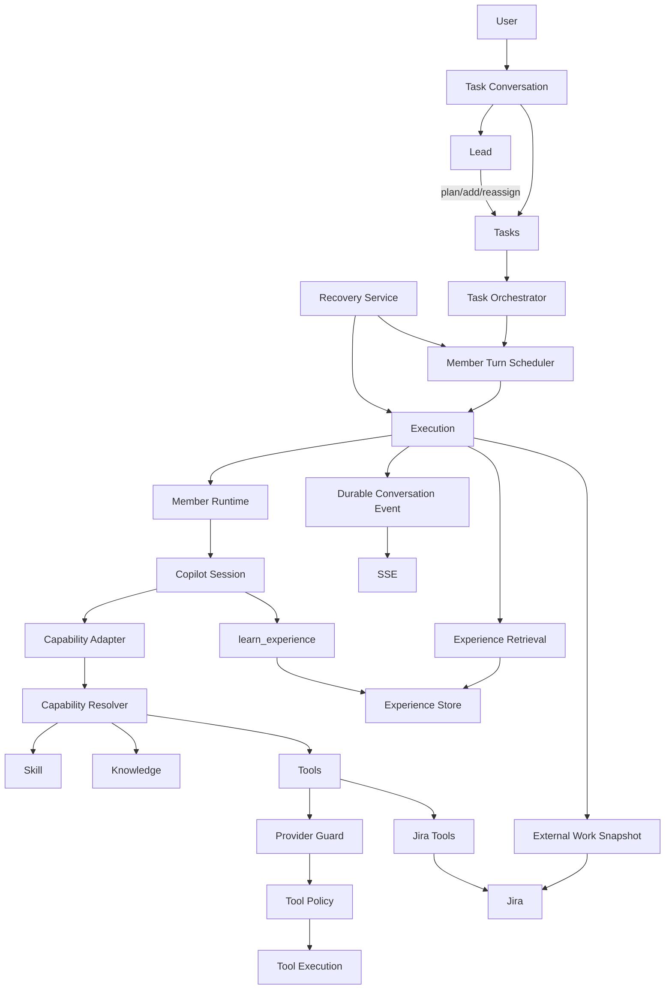

# team-member-copilot-agent 当前架构解析

> 基于 `saga/team-member-copilot-agent` `main` 分支当前代码整理（0.4.3）。  
> 当前基准提交：`0e53e3d4be755b6b85bff3d7284e6938596dccfa`。
>
> 仓库：<https://github.com/saga/team-member-copilot-agent>

## 1. 系统定位

这不是“几个 Agent 一起聊天”的 Chat 系统，而是一个以 **Task 为核心、Lead 为协调者、Member 为长期业务身份、Execution 为运行与审计单位** 的 Server-side AI Team Runtime。

核心对象：

```text
Team
 └─ Conversation (Task Workspace)
      ├─ Lead Member
      ├─ ConversationTask
      │    └─ Execution
      │         └─ MemberRuntime
      │              └─ Copilot Session
      └─ shared messages / files / requirements
```

最重要的边界是：

```text
Member          = 长期业务身份
Conversation    = 一次工作空间
Task            = 具体业务工作
Execution       = 一次实际运行
MemberRuntime   = 某 Member 在某 Conversation 中的运行实例
Copilot Session = Runtime 使用的 Agent Engine 状态
```

因此 Copilot SDK 不是业务模型的中心，未来可以替换为 DeepAgents / OpenCode / Claude Agent SDK 等。

---

## 2. 总体架构



核心思想是：

```text
LLM / Member Runtime
    = reasoning + execution

Control Plane
    = state + authorization + scheduling + recovery + model policy

Database / Filesystem
    = durable business state + artifacts
```

---

## 3. Conversation：用户操作的是工作，而不是 Chat

`Conversation(kind = task)` 就是 Task Workspace。

它包含：

```text
objective
leadMemberId
status
requirements
openQuestions
tasks
messages
files
externalWorkRef
```

用户消息只唤醒 Lead：

```text
User message
   ↓
Lead
```

不存在传统的：

```text
Everyone
Chat Mode
多个 Member 抢答
```

另有：

```text
Conversation(kind = direct)
```

仅用于 Member ↔ Member 内部私聊。

这体现了一个核心设计：

> 用户给 Team 一个工作，Lead 负责理解和协调，具体执行通过 Task 分派，不通过群聊争夺发言权。

---

## 4. Lead：协调者，不是万能执行者

Lead 的主要职责：

```text
理解目标
  ↓
判断是否需要澄清
  ↓
检查 Jira / Knowledge / Conversation
  ↓
建立 Task Plan
  ↓
分配 Member
  ↓
处理失败/阻塞
  ↓
最终综合
```

初始计划使用：

```text
plan_tasks
```

已有计划不重新创建，而是：

```text
add_task
reassign_task
```

因此计划可以增量调整，而不会销毁 Task / Execution 历史。

Lead 可以把不同任务分给不同 Member，依赖满足时并行运行。

---

## 5. Goal / Task：业务目标有版本，任务属于某个版本

Goal Revision = 业务目标版本，Task = 某个 Goal Revision 下的执行单元，
旧 Goal 的 Task = 历史事实，不再推进。

```text
Initial Goal
    ↓
plan_tasks
    ↓
Goal v1


用户/Lead 修改目标
    ↓
update_goal
    ↓
Goal v2
    ↓
旧未完成 Task → cancelled（活着的 execution 级联停掉，含 Lead 自己的那一轮）
    ↓
replan_tasks
    ↓
Goal v2 Task Plan
```

规则（`server/task-service.ts` reviseGoal + `server/team-service.ts` updateGoal）：

```text
plan()        只在还没有正式 Goal（revision 0）时建 v1
replan()      只在已有 Goal、且当前版本无任务时重建计划
update_goal   生成不可变的新版本；v1 历史永不修改，“恢复旧版”也是新版本
旧 Task       只读历史：update / retry / reassign 拒绝跨版本操作
add_task      依赖只能是同版本 + pending / ready / running / completed，
              旧版本与 failed / blocked / cancelled 一律拒绝
Lead 那一轮   用户改 Goal 时正在跑也照停；停不掉的 race 由 turn 收尾的
              版本号守卫兜底（旧 Goal 回复不落库、不自唤醒）
```

Task 包含：

```text
id
title
description
assigneeMemberId
dependencies
acceptanceCriteria
result
blocker
currentExecutionId
modelTier
status
goal_revision
```

状态：

```text
pending → ready → running
                      ├─ completed
                      ├─ failed
                      └─ blocked

cancelled
```

重要原则：

> Task 是否完成由服务端状态决定，而不是由 LLM 说“完成了”决定。

Task Agent 必须使用：

```text
update_task(status=completed)
```

如果 Agent turn 结束时任务仍然是 `running`，平台会按执行异常处理，而不是默认当作成功。

Conversation 的最终状态由 Task 状态确定：

```text
all completed
    → conversation completed

存在 failed / blocked
    → conversation blocked
```

`TaskService.list()` 只返回当前 Goal Revision：

```text
ConversationTask 当前列表 = 当前 Goal Revision
旧 Goal Task = 历史，不进入当前执行计划

Goal Revision History + 旧 Task + 旧 Execution = 完整历史追踪链
```

---

## 6. TaskOrchestrator：推进业务状态，不执行 Agent

职责：

```text
Task ready
Task completed
Task failed
Task blocked
```

形成：

```text
refresh ready
→ enqueue execution
→ push dependency wave
→ wake Lead on failure/block
→ recompute Conversation status
```

它不负责：

```text
Copilot
LLM
Tool execution
```

所以业务状态和 Agent runtime 解耦。

第一版刻意只支持简单 `dependencies[]`，不引入 BPMN、Temporal 或独立 DAG engine。

---

## 7. MemberTurnScheduler：解决并发和重复唤醒

Scheduler 位于：

```text
事件
 ↓
Wake
 ↓
MemberTurnScheduler
 ↓
Execution
```

它负责：

### 同一 Member 串行

同一 `(conversation, member)` 同时最多一个 turn。

### Wake coalescing

短时间多个事件不会直接开多个 Agent turn，而是合并 pending wake。

当前最新代码已经移除了 `ensureLeadWake()` 对 busy Lead 的直接拒绝；新 wake 统一进入 Scheduler，由 Scheduler 合并。因此：

```text
Lead 正忙
+
新的用户消息
```

不会启动第二个并发 Lead turn，但会保存一个待处理 wake。

### Wake 持久化

Wake 会带：

```text
conversationId
memberId
taskId
reason
triggerSequence
```

进程重启以后可以原样恢复，而不是根据当前状态重新猜。

---

## 8. Execution：每一次真实 Agent 工作的事实

Execution 是整个运行与审计链的中心。

它记录：

```text
conversationId
memberId
taskId
runtimeId
parentExecutionId
delegationPath
status
prompt
response
error
waitingForRuntimeId
retryOfExecutionId
triggerMessageSequence
wakeReason
configSnapshot
externalWorkRef
externalWorkSnapshot
```

因此系统可以回答：

```text
谁执行的？
在哪个 Task？
为什么被唤醒？
用了哪个 Runtime？
是不是 delegation？
用了哪个模型？
用了什么 Capability？
当时 Jira 是什么状态？
结果是什么？
是否失败？
是否 retry？
```

---

## 9. Member ↔ Member 协作

有两种机制：

### ask_member

阻塞式 RPC：

```text
Parent Execution
    ↓
waiting_for_member
    ↓
Child Execution
    ↓
Target Member
    ↓
result
    ↓
Parent resumes
```

### message_member

只投递消息：

```text
send
→ delivered
→ 不等待回复
```

因此：

```text
ask_member     = blocking delegation RPC
message_member = asynchronous message
```

不会把“聊天”和“工作委派”混为一谈。

同时：

```text
parentExecutionId
delegationPath
waitingForRuntimeId
```

用于防止 delegation cycle 和 wait-for deadlock。

---

## 10. ContextAssembler：共享历史不是每次全量重放

系统同时拥有两个历史：

```text
Copilot Session History
Conversation Shared History
```

不能每轮把整个 Conversation 再塞给模型。

所以 `MemberRuntime` 保存：

```text
lastContextMessageSequence
```

每轮只注入：

```text
message_sequence > checkpoint
```

的新增 shared messages。

同时排除：

1. 当前 execution 的触发消息
2. 当前 Member 自己已经进入 session history 的历史消息

checkpoint 只在 turn 成功后推进；失败时保留，宁可重复上下文，也不丢上下文。

Context 还有：

```text
MAX_CONTEXT_MESSAGES
MAX_CONTEXT_CHARS
```

双限制，并保留最新消息；如果历史被截断，会明确告诉模型“有多少更早消息未展示”。

---

## 11. Capability Architecture：能力不是代码里的角色判断

一个 Member 能做什么不是：

```ts
if (member.role === "architect")
```

而是：

```text
global capabilities
      +
team capabilities
      +
member capabilities
      ↓
effective capabilities
```

能力分三类：

```text
Skill
Knowledge
Tool
```

三层：

```text
global
team
member
```

`Member` 只保存自己的增量，不复制 global/team baseline。

这样 Team Capability 改动后，所有成员自然继承。

---

## 12. Capability Resolver：引擎无关的能力解析层

完整链路：

```text
CapabilityService.getEffective()
        ↓
MemberCapabilities
        ↓
CapabilityResolver.resolve()
        ↓
RuntimeCapabilities
        ↓
CopilotCapabilityAdapter
        ↓
Copilot SDK
```

`RuntimeCapabilities` 包含：

```text
skills
knowledge
tools
toolIndex
manifestHash
```

`CopilotService` 不直接读取：

```text
Jira
Knowledge
Filesystem Skill
Capability DB
```

而只接受解析好的 `RuntimeCapabilities`。

因此换 Agent Engine 时，业务模型不用跟着变化。

---

## 13. Tool：声明和授权分开

工具有两个问题：

```text
模型看得见什么？
这次调用是否真的允许？
```

当前链路：

```text
RuntimeCapabilities
        ↓
availableTools
        ↓
Copilot SDK
        ↓
onPreToolUse
        ↓
Provider guard
        ↓
ToolPolicy
        ↓
execute
```

### Guard

Provider 负责：

```text
输入格式
路径边界
自己的参数约束
```

### Policy

Policy 负责：

```text
external-write
privileged
host access
```

最终规则不是：

```ts
if (toolName === "bash")
```

而是依据：

```text
risk
requiresHostAccess
guard
PolicyService
```

因此新增工具时，不需要修改一个集中式“工具名字白名单”。

---

## 14. Policy：当前已经有抽象，但还没有真正的中央 Policy 服务

代码中存在：

```text
PolicyService
DenyHighRiskPolicyService
DefaultToolPolicy
```

当前默认高风险动作是拒绝的。

所以架构状态是：

```text
Policy abstraction      = 已存在
独立中央 Policy Service = 尚未接入
```

这为以后接企业 Policy Engine 预留了明确位置。

核心原则：

> Provider 负责实现工具，但不能自己批准自己的高风险动作。

---

## 15. Skill

Skill 是：

```text
HOW
```

当前存储：

```text
.data/global/skills/
.data/team/skills/<teamId>/
.data/members/<memberId>/skills/
```

核心文件：

```text
SKILL.md
```

Skill 是目录，不是数据库 business object。

`SkillService` 负责安装/删除，安装时有：

```text
path traversal 防护
file count limit
total bytes limit
symlink 拒绝
staging + atomic rename
```

所以 Skill 是可扩展能力，但内容仍被视为不可信输入。

---

## 16. Knowledge

Knowledge 是：

```text
WHAT
```

而 Skill 是：

```text
HOW
```

Knowledge Provider 提供：

```text
listSources()
search()
open()
```

检索结果包含：

```text
snippet
citation
authority
sourceUri
```

`open()` 重新做 ACL，不能因为 documentRef 来自 search 就默认允许打开。

这使：

```text
retrieval
```

和：

```text
authorization
```

保持分离。

---

## 17. Memory：长期上下文

当前有两层：

```text
.data/members/<memberId>/memory/MEMORY.md
.data/members/<memberId>/teams/<teamId>/MEMORY.md
```

含义：

```text
Global Memory = 跨 Team 稳定的长期习惯/事实
Team Context  = 当前 Team 的工作方式/项目上下文
```

两个文件都有：

```text
sha256 version
optimistic concurrency
atomic write
```

所以用户 UI 和 Agent 同时修改记忆时，不会静默覆盖。

---

## 18. Experience：当前已经实现的 Self-Improvement

当前架构已经包含真正运行中的 Experience loop：

```text
用户纠正 / 成功经验 / 失败经验
          ↓
learn_experience
          ↓
ExperienceStore
          ↓
下一轮自动 retrieval
          ↓
ContextAssembler
          ↓
Member behavior changes
```

Experience 类型：

```text
success
failure
user_feedback
preference
strategy
```

数据：

```text
trigger
lesson
evidence
scope
confidence
useCount
lastUsedAt
```

保存位置：

```text
.data/experiences/<teamId>/experiences.jsonl
```

---

## 19. 为什么 Experience 不等于 MEMORY.md

`MEMORY.md`：

```text
“这个 Member 长期知道什么”
```

Experience：

```text
“遇到类似事情以后应该怎么做”
```

例如：

```text
trigger:
Jira Story with existing subtasks

lesson:
先检查已有 Subtask，再补缺失工作，不要复制已有工作。
```

Experience 每轮自动搜索，不要求 Agent 自己记得“去搜索经验”。

因此 Self-Improvement 真正闭环的是：

```text
Feedback
→ Experience
→ Retrieval
→ Behavior
```

当前还没有自动：

```text
Experience → Skill Candidate → Eval → Publish
```

这属于下一阶段。

---

## 20. Model Policy：模型选择也是控制面

当前：

```text
Strong
Standard
Cheap
```

约束：

```text
Strong Lead > Standard Lead >= Member
```

Lead 的模型不是固定的：

```text
planning       → Strong
clarification  → Strong
recovery       → Strong
synthesis      → Strong
routine        → Standard
```

判断由控制面确定性完成，不让 LLM 自己决定“我要更强模型”。

Task 还可以由 Lead 指定：

```text
modelTier = cheap | standard | strong
```

其中：

```text
null   → 跟 Member 默认
strong → 复杂 Task 升级到 Strong
```

所以“强模型”是一种控制面资源，而不是 Agent 的自我升级权限。

---

## 21. Jira：外部事实源

本地没有：

```text
JiraIssue
Project
WorkItem
```

这样的业务对象。

只有：

```text
ExternalWorkRef
ExternalWorkSnapshot
```

业务事实仍在 Jira：

```text
title
description
status
assignee
workflow
subtasks
```

Execution 开始时，控制面通过同一个 Jira Provider 做一次确定性 snapshot。

因此：

```text
Jira = source of truth
local DB = runtime/audit reference
```

Agent 的 Jira 工具和控制面取证使用同一个 Provider，但职责不同：

```text
Agent → jira tools
Control Plane → direct provider
```

控制面不会依赖 LLM 是否愿意调工具。

---

## 22. Jira 的写入边界

当前 Agent 有：

```text
jira_search
jira_get_issue
jira_add_comment
jira_transition_issue
```

其中：

```text
jira_add_comment
jira_transition_issue
```

属于：

```text
external-write
```

要经过 Policy。

没有直接开放：

```text
jira_assign_issue
```

体现的是：

> “Provider 实现了动作”不等于“Agent 得到了动作授权”。

---

## 23. Conversation Files

聊天上传文件有自己的语义：

```text
ACL = Conversation membership
```

它不会因为能搜索就自动进入 Knowledge Base。

因此：

```text
聊天附件
≠
长期企业知识
```

长期复用需要显式 promote。

原文件和 extracted text 也分离：

```text
original file → Copilot attachment
extracted text → search/index
```

避免重复把文件正文塞进 prompt。

---

## 24. Runtime 隔离

每个：

```text
Conversation + Member
```

拥有独立：

```text
workspace
Copilot Session
Runtime state
checkpoint
```

因此：

```text
Agent A
```

不能靠 filesystem 直接读取：

```text
Agent B
```

的工作空间。

Member 协作应该走：

```text
Task
ask_member
message_member
Knowledge
```

而不是绕过控制面共享文件。

---

## 25. Reliability

系统没有依赖：

```text
Redis
Kafka
Temporal
```

实现了本地化的可靠运行机制：

```text
SQLite durable state
+
Member runtime lock
+
Scheduler
+
RecoveryService
+
durable conversation events
```

### 崩溃恢复

启动后：

```text
queued root       → requeue
queued child      → interrupted
running           → interrupted
waiting_for_member→ interrupted
```

running 不自动重跑。

核心思想：

> 宁可漏跑，不可因为不知道进程崩溃前发生了什么而重复执行副作用。

### Retry

Retry 创建新 Execution：

```text
retryOfExecutionId
```

不覆盖旧 execution。

---

## 26. Durable Event + SSE

数据库：

```text
conversation_event
```

是 source of truth。

流程：

```text
mutation
  ↓
DB commit
  ↓
event
  ↓
broadcast
  ↓
SSE
```

SSE 使用：

```text
sequence
Last-Event-ID
```

重连时可以 replay。

`message.delta` 是唯一不持久化的高频 token stream；最终 `message.created` 提供完整事实。

---

## 27. Scheduled Wake

定时任务不经过普通 Conversation Wake Scheduler。

流程：

```text
ScheduledWake
   ↓
ScheduledWakeRun
   ↓
Execution
   ↓
executeMemberTurn
```

与普通消息唤醒分开，是为了避免 scheduler 的 coalescing 把定时工作错误合并掉。

---

## 28. 数据存储分工

### SQLite

用于结构化状态：

```text
Team
Member
Membership
Capability
Conversation
Message
Task
Runtime
Execution
Wake
Schedule
Knowledge metadata
Conversation event
```

### Filesystem

用于：

```text
MEMORY.md
Team Context
Skills
Experience JSONL
Conversation original files
```

所以总体是：

```text
SQLite = structured runtime/business state
Filesystem = human-readable / large / append-oriented artifacts
```

Schema 当前采用：

```text
SCHEMA_VERSION = 23

conversation.goal_revision
conversation_goal_revision（不可变版本历史）
conversation_task.goal_revision
execution.goal_revision
```

没有 migration chain；schema shape 不匹配则拒绝启动并重建本地库。

---

## 29. 一次用户请求的完整链路

```text
User
 ↓
Task Conversation
 ↓
Current Goal Revision
 ↓
persist message
 ↓
Lead Wake
 ↓
MemberTurnScheduler
 ↓
Execution
 ↓
External Work Snapshot
 ↓
Experience Retrieval
 ↓
ContextAssembler
 ↓
CapabilityResolver
 ↓
Model Policy
 ↓
Config Snapshot
 ↓
Copilot Capability Adapter
 ↓
Copilot SDK
 ↓
 LLM
 ├─ Knowledge / Skill / Tool / ask_member / jira_search / learn_experience
 ├─ update_goal
 ├─ plan_tasks
 ├─ replan_tasks
 ├─ add_task
 ├─ reassign_task
 └─ update_task
 ↓
Execution result
 ↓
Task / Goal State
 ↓
Durable Event
 ↓
SSE/UI
```

---

## 30. 这套架构最核心的“不要混”

| 不要混 | 正确关系 |
|---|---|
| Member / Copilot Session | Member 是长期身份，Session 是运行引擎 |
| Conversation / Task | Conversation 是工作空间，Task 是具体工作 |
| Task / Execution | Task 是业务状态，Execution 是运行事实 |
| Runtime / Scheduler | Runtime 是执行实例，Scheduler 管唤醒 |
| Skill / Knowledge | Skill = 如何做，Knowledge = 知道什么 |
| Capability / Policy | Capability = 能力声明，Policy = 本次授权 |
| Jira / Conversation | Jira 是业务事实源，Conversation 只存引用 |
| Memory / Experience | Memory = 长期上下文，Experience = 可复用策略 |
| Wake / Execution | Wake = 应该运行，Execution = 已经运行 |
| Event / SSE | Event = 事实，SSE = 传输 |
| Member.role / Membership.role | 职业身份 vs 组织权限 |

---

## 31. 当前架构体现的五个核心原则

### 1. LLM 负责 reasoning，不负责定义系统边界

```text
LLM can suggest
Control Plane decides
```

### 2. Business State 在控制面

```text
Task
Conversation
Membership
Capability
Policy
Execution
```

都不是由模型自由修改其语义。

### 3. 外部事实不复制

```text
Jira = Jira
Knowledge Provider = Knowledge source
```

避免第二份真相。

### 4. 重要行为都留下运行事实

Execution + Config Snapshot + Durable Event 构成可追溯链。

### 5. Recovery 优先防止重复副作用

```text
unknown state → interrupted
```

而不是盲目 auto retry。

---

## 32. 当前 Self-Improvement 的边界

目前已经是：

```text
Feedback
  ↓
Experience
  ↓
Automatic retrieval
  ↓
Behavior change
```

还不是：

```text
Experience
  ↓
automatic reflection
  ↓
Skill candidate
  ↓
evaluation
  ↓
publish
```

后续自然演进方向是：

```text
Experience
  ↓
Repeated pattern
  ↓
Skill Candidate
  ↓
Evaluation
  ↓
Versioned Skill
  ↓
Human approval
  ↓
Team / Member Skill
```

而：

```text
Capability
Policy
Data Entitlement
Model Policy
Security Boundary
```

仍然属于 Control Plane，不能被 Self-Improvement 自己修改。

---

## 33. 当前代码阅读地图

| 领域 | 主要文件 |
|---|---|
| Domain | `server/domain.ts` |
| Application wiring | `server/app.ts` |
| Team / Conversation / Execution | `server/team-service.ts` |
| Task state | `server/task-service.ts` |
| Goal Revision | `server/task-service.ts` + `server/team-service.ts` + `server/test/goal-revision.test.ts` |
| Task orchestration | `server/task-orchestrator.ts` |
| Wake scheduler | `server/member-turn-scheduler.ts` |
| Crash recovery | `server/recovery-service.ts` |
| Context | `server/context-assembler.ts` |
| Copilot integration | `server/copilot.ts` |
| Engine adapter | `server/capabilities/copilot-adapter.ts` |
| Capability resolution | `server/capabilities/resolver.ts` |
| Capability persistence | `server/capabilities/service.ts` |
| Tool contract | `server/capabilities/types.ts` |
| Tool policy | `server/tool-policy.ts` |
| Policy abstraction | `server/policy.ts` |
| Model routing | `server/model-policy.ts` |
| Long-term memory | `server/member-memory.ts` |
| Self-improvement | `server/experience-store.ts` |
| Member lifecycle | `server/member-service.ts` |
| Skill lifecycle | `server/skill-service.ts` |
| Jira tools | `server/capabilities/providers/jira-tools.ts` |
| Jira provider | `server/work-management/jira-provider.ts` |
| Jira client | `server/jira/client.ts` |
| Files | `server/conversation-file-service.ts` |
| Schema | `server/db-migrations.ts`（SCHEMA_VERSION 23） |
| Frontend Task Workspace | `src/components/team/*` |

---

## 34. 一句话总结

当前 `team-member-copilot-agent` 可以概括为：

> **一个“确定性 Control Plane + 概率性 Member Runtime”的 AI Team 系统。**

模型的自由主要存在于：

```text
下一步应该怎么做
```

而不是：

```text
系统允许做什么
业务状态是什么
任务是否完成
外部事实是什么
当前动作是否授权
```

这就是当前架构最核心的思想。

## 35. 主要源码入口

- <https://github.com/saga/team-member-copilot-agent/blob/main/server/domain.ts>
- <https://github.com/saga/team-member-copilot-agent/blob/main/server/team-service.ts>
- <https://github.com/saga/team-member-copilot-agent/blob/main/server/task-service.ts>
- <https://github.com/saga/team-member-copilot-agent/blob/main/server/task-orchestrator.ts>
- <https://github.com/saga/team-member-copilot-agent/blob/main/server/member-turn-scheduler.ts>
- <https://github.com/saga/team-member-copilot-agent/blob/main/server/context-assembler.ts>
- <https://github.com/saga/team-member-copilot-agent/blob/main/server/capabilities/resolver.ts>
- <https://github.com/saga/team-member-copilot-agent/blob/main/server/tool-policy.ts>
- <https://github.com/saga/team-member-copilot-agent/blob/main/server/model-policy.ts>
- <https://github.com/saga/team-member-copilot-agent/blob/main/server/experience-store.ts>
- <https://github.com/saga/team-member-copilot-agent/blob/main/server/recovery-service.ts>
- <https://github.com/saga/team-member-copilot-agent/blob/main/server/db-migrations.ts>
